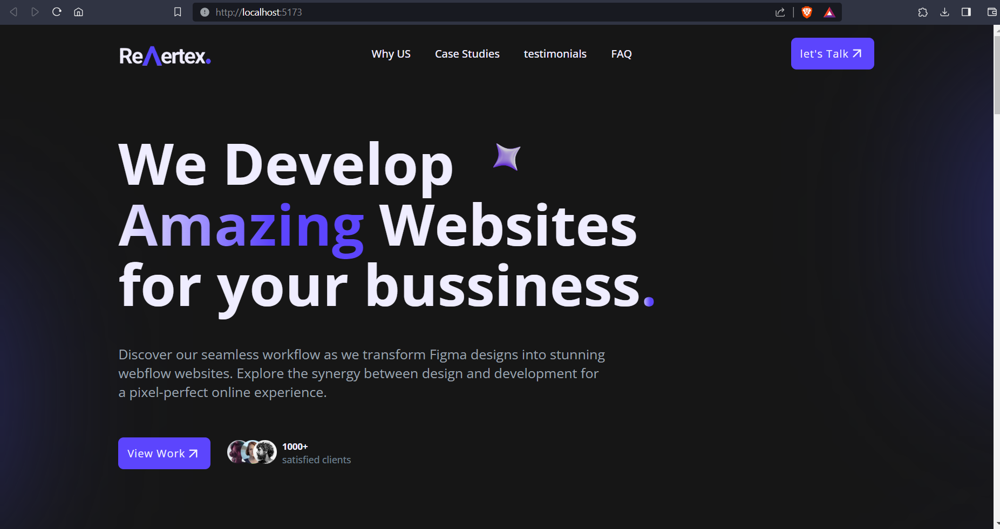
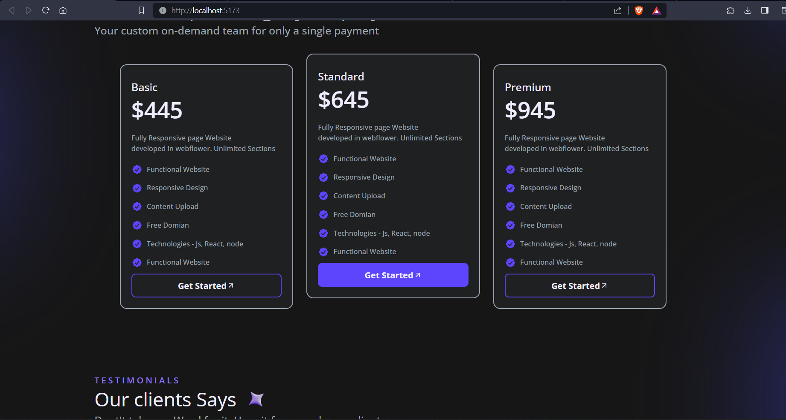
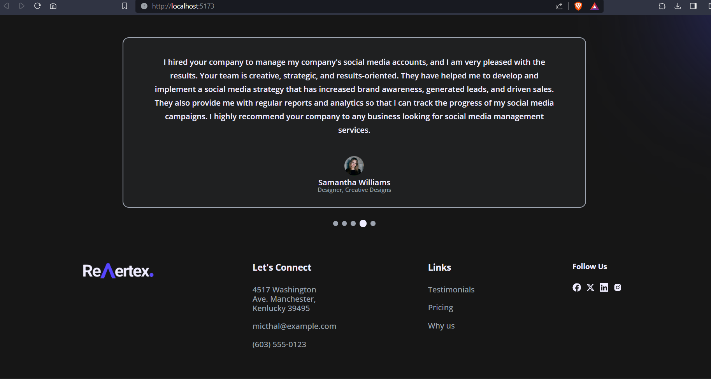

## Revertex Business Website

Welcome to my web development project! This project is a demonstration of my skills and creativity, created purely for practice and showcasing my abilities as a web developer. It's a versatile and well-rounded website designed to serve as a practical exercise to improve my web development skills.

## Demo

You can see live demo - https://revertex-rishabh.netlify.app/


## Screenshots








## Development

To get a local copy of the code, clone it using git:

```
git clone https://github.com/rjkush17/Revertex-landing-page.git
cd Revertex
```

Install dependencies:

```
npm install
```

Now, you can start a local web server by running:

```
npm run dev
```

## Available Scripts
In this project, you can use the following scripts:

**npm run dev**: Runs the application in the development mode.

**npm run build**: Builds the application for production, placing the output in the "dist" folder.

**npm test**: Launches the test runner in interactive watch mode.

Other Vite-specific scripts as per your project's configuration.

# Key Features

**Enhanced Flexibility**: For users on low-width devices, we've introduced a convenient slider feature for navigation, allowing you to access content effortlessly.

**Responsive Design**: Enjoy a seamless user experience on both mobile and laptop devices.
## Tech Stack

To built with the following technologies:

- [Vite](https://vitejs.dev/) - A fast build tool for React applications.
- [React](https://reactjs.org/) - A popular JavaScript library for building user interfaces.
- [CSS](https://developer.mozilla.org/en-US/docs/Web/CSS) - A utility-first CSS framework for rapidly designing web applications.
- [Vercel](https://vercel.com/) - A cloud platform for deploying and hosting web applications.


